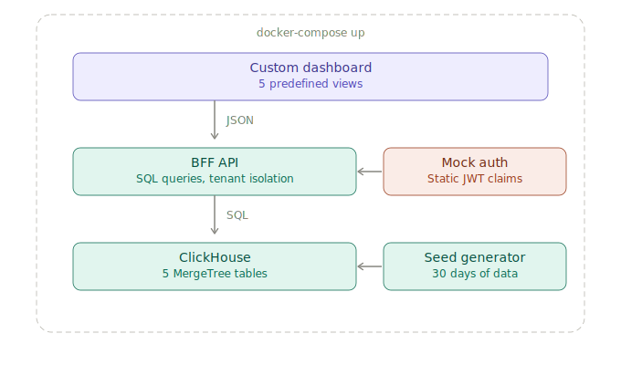
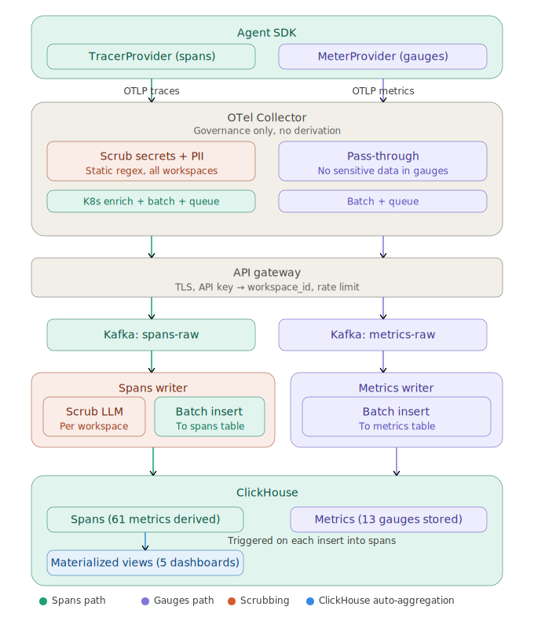

# AI Agent Analytics Dashboard

A customer-facing organizational-level analytics dashboard for monitoring cloud-hosted AI agents. Provides real-time visibility into agent execution health, tool-call performance, LLM token usage, error breakdown, and cost tracking — scoped per workspace with tenant isolation enforced server-side.

The repository contains a **system design** (architecture documents, decision records, metrics catalog) and a **working implementation** (ClickHouse + Express.js BFF + React dashboard) that can be spun up with a single command.

## Quick start

```bash
git clone <repo-url> && cd agent-monitor
pnpm install
docker-compose up -d                                  # ClickHouse + BFF + Frontend
pnpm --filter @agent-monitor/clickhouse seed          # generates 30 days of realistic data
open http://localhost:3000                             # dashboard with live ClickHouse queries
```

The stack runs as three Docker containers: ClickHouse for storage, an Express.js BFF for API queries, and a React frontend behind nginx. Seed data covers 3 organizations, 5 workspaces, 10 agent types, 15 tools, and 4 LLM models with realistic daily patterns, error spikes, and version rollouts.

## Architecture overview

The stack runs as three containers behind `docker-compose`. ClickHouse serves as the analytical storage backend — the same engine used by Langfuse, Helicone, PostHog, and other observability platforms in production. The BFF enforces tenant isolation by injecting `workspace_id` from JWT claims into every parameterized SQL query. The browser never sees SQL.

<p align="center">
  
</p>

## System design

The architecture separates concerns into a write path (data ingestion) and a read path (dashboard queries), connected through Kafka with ClickHouse as the analytical storage backend.

### Write path

Agent SDKs emit structured events via OTLP to a per-node OTel Collector DaemonSet, which batches and forwards through an API gateway. The gateway resolves API keys to workspace IDs, enforces rate limits, and produces to Kafka partitioned by workspace. ClickHouse consumes from Kafka into MergeTree tables with per-month partitioning and TTL-based retention. Usage metering and anomaly detection run as separate Kafka consumer groups with no backpressure on the main ingestion path.

<p align="center">
  
</p>

ClickHouse's columnar storage with LowCardinality encoding and MergeTree partitioning handles the AI agent workload efficiently — each event corresponds to an LLM call (1–30s) or tool call, producing ~2,500 events/s per node at peak. Cold data migrates to object storage via TTL rules.

### Read path

The custom dashboard fetches structured JSON from a BFF (backend-for-frontend) that owns all SQL queries. The BFF validates JWTs, extracts the workspace ID from token claims, executes predefined parameterized queries against ClickHouse, and returns formatted results. Platform engineers use an internal Grafana instance with the ClickHouse datasource plugin for ad-hoc SQL exploration.

<p align="center">
  
</p>

The server-owned query model eliminates SQL injection, cross-workspace query manipulation, and unbounded query DoS — the browser never sees SQL. Every query injects `workspace_id` as a parameterized value derived from the JWT.

## Dashboard views

| View | Panels | Refresh |
|------|--------|---------|
| Agent execution overview | Active agents, invocation rate by agent, error rate, p95 latency, errors by type, step distribution | 30s |
| Tool-call performance | Per-tool latency p50/p95/p99, tool error rates, call frequency, retry rate, slowest tools table | 30s |
| LLM token usage | Total tokens, tokens by model, prompt vs completion split, token rate, cost by model, top consumers | 60s |
| Error breakdown | Error count, error rate trend, errors by type/agent/version, top error messages table | 30s |
| Cost tracking | Daily cost, projected monthly, cost per invocation, week-over-week delta, cost by agent/model | 300s |

## Project structure

```
agent-monitor/
├── docker-compose.yml
├── packages/
│   ├── frontend/               # React 18+ / TypeScript / Vite
│   │   ├── src/
│   │   │   ├── components/charts/   # uPlot, ECharts, Ant Design Table
│   │   │   ├── pages/              # 5 view pages
│   │   │   ├── hooks/              # useView (TanStack Query), useAuth
│   │   │   └── utils/              # Formatters, transforms
│   │   └── __tests__/
│   ├── bff/                    # Express.js API server
│   │   ├── src/
│   │   │   ├── middleware/         # JWT auth, audit logging
│   │   │   ├── queries/           # SQL per view (5 modules, ~35 queries)
│   │   │   ├── clickhouse/        # Client wrapper, parameterized queries
│   │   │   └── routes/            # /api/views/:viewId, /api/workspaces
│   │   └── __tests__/
│   ├── clickhouse/             # Schema and seed data
│   │   ├── init/                  # CREATE TABLE DDL
│   │   └── seed/                  # Deterministic data generator
│   └── shared/                 # TypeScript types (ViewResponse, Panel)
├── specs/                      # System design documents
│   ├── 00-core-requirements.md
│   ├── 01-development-plan.md
│   └── 02-test-scenarios.md
├── diagrams/                   # SVG architecture diagrams
└── .github/workflows/ci.yml
```

## Development

```bash
# Prerequisites: Node 20+, pnpm 9+
corepack enable

# Install dependencies
pnpm install

# Start ClickHouse + BFF + Frontend
docker-compose up -d

# Seed sample data (30 days, 99K+ rows)
pnpm --filter @agent-monitor/clickhouse seed

# Development servers
pnpm dev:frontend    # Vite dev server (port 5173)
pnpm dev:bff         # BFF with hot reload (port 3001)
```

## What's real vs what's mocked

| Component | Implementation | Status |
|-----------|---------------|--------|
| Analytical storage | ClickHouse (MergeTree, partitioned, TTL) | Real |
| BFF API | Express.js, parameterized SQL, tenant isolation | Real |
| Dashboard | React, 5 predefined views, auto-refresh | Real |
| Workspace isolation | `workspace_id` from JWT, injected server-side | Real |
| Authentication | Static JWT with configurable claims | Mocked (production: OIDC/SAML + MFA) |
| Ingestion pipeline | Seed script generates data | Mocked (production: OTel Collector → Kafka → ClickHouse) |
| Anomaly detection | Not implemented | Phase 2 (Flink streaming jobs) |
| Alerting engine | Static mock alerts | Phase 2 (per-workspace rules) |
| Secret scrubbing | Seed data is clean by construction | Phase 2 (pipeline-level PII redaction) |
| Internal Grafana | Not included | Phase 2 (ClickHouse datasource plugin) |
| Usage metering | ClickHouse aggregate queries | Real (production adds Kafka-based billing path) |

## Testing

```bash
pnpm test                           # Unit + integration (Vitest)
pnpm --filter bff test:integration  # BFF against real ClickHouse
pnpm e2e                            # Playwright smoke tests
```

Test priorities:

1. **Tenant isolation** — workspace A never sees workspace B's data. Every SQL query uses parameterized `workspace_id`. Cross-workspace leakage tests run against real ClickHouse with multi-workspace seed data.
2. **Query correctness** — error rate math, percentile calculations, time bucketing, cost formulas validated against known test data.
3. **E2E smoke** — all 5 views render with populated panels, workspace switching changes data, no console errors.

Coverage targets: 90%+ line coverage for `utils/` and `api/`, 85%+ for components, 100% for formatters and type guards.

## Key decisions

**Why ClickHouse?** ClickHouse is the storage engine behind Langfuse, Helicone, PostHog, and other AI observability platforms. Its columnar MergeTree engine handles both time-series ingestion and analytical queries in a single system — no separate metrics, logs, and traces backends. SQL is the most LLM-friendly query language, which means every query in the BFF was vibe-coded effectively. Native TTL, partitioning, and materialized views cover retention and pre-aggregation without external tooling.

**Why server-owned queries?** The BFF owns all SQL. The browser requests named views (`GET /api/views/agent-overview`), never query language. This eliminates injection attacks, query DoS, cardinality exploration, and simplifies RBAC to authentication-only in Phase 1.

**Why predefined views?** Tenants see 5 static dashboards with no interactive controls (no time picker, no filters, no query builder). This is the minimum viable dashboard that is production-deployable. The tradeoff (no ad-hoc exploration) is acceptable because Grafana with the ClickHouse datasource serves that need for platform engineers, and tenant self-service can be added later.

## Design documents

| Document | Covers |
|----------|--------|
| [Core requirements](specs/00-core-requirements.md) | 41 requirements across 9 sections, scoped to assignment |
| [Development plan](specs/01-development-plan.md) | 6-phase implementation roadmap with acceptance criteria |
| [Test scenarios](specs/02-test-scenarios.md) | Test pyramid, coverage targets, E2E smoke specs |
